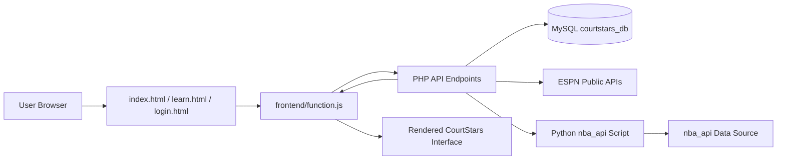
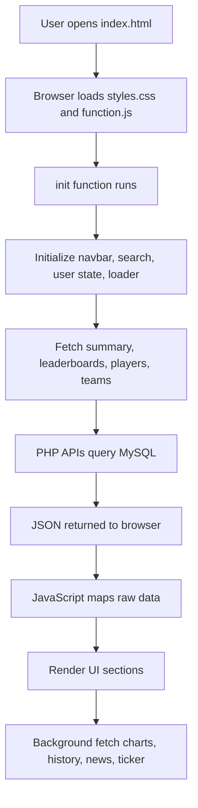
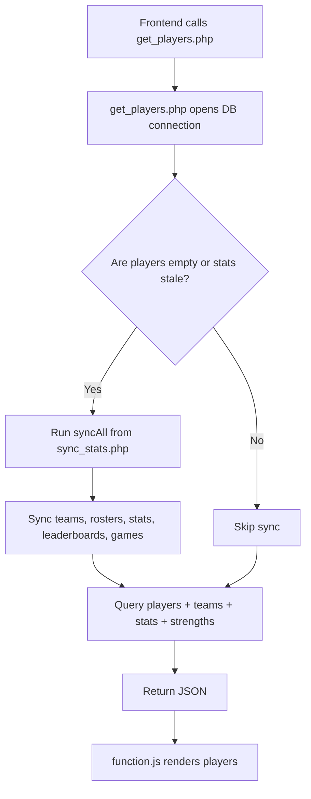
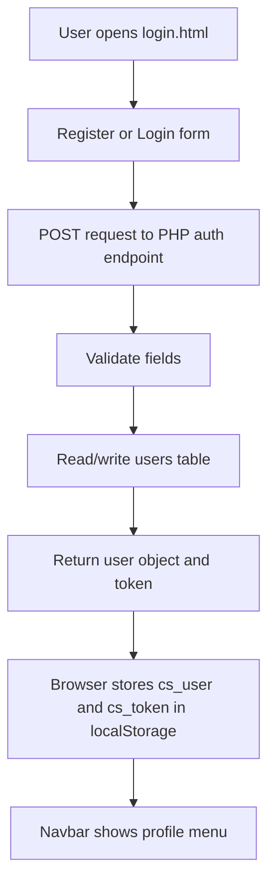
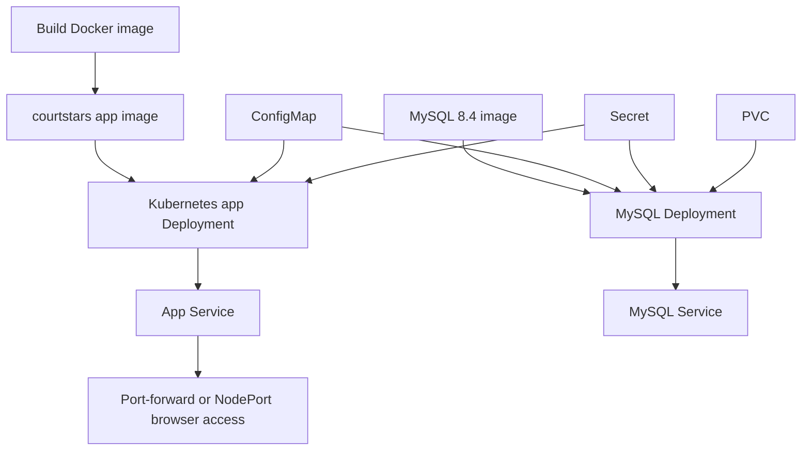
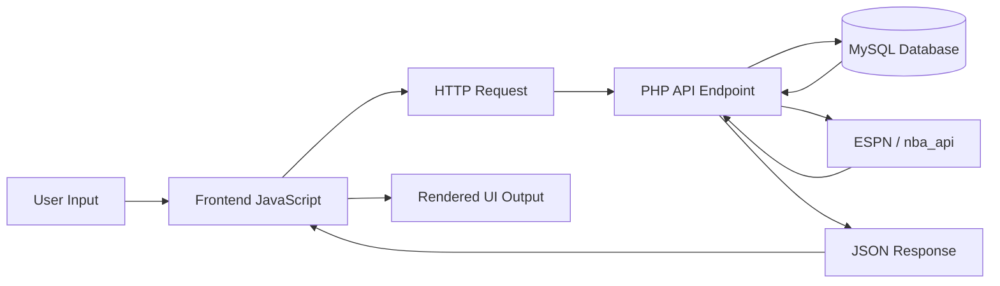
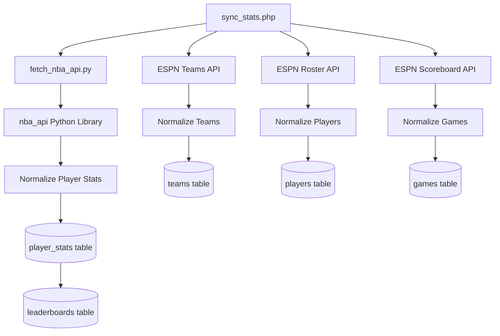
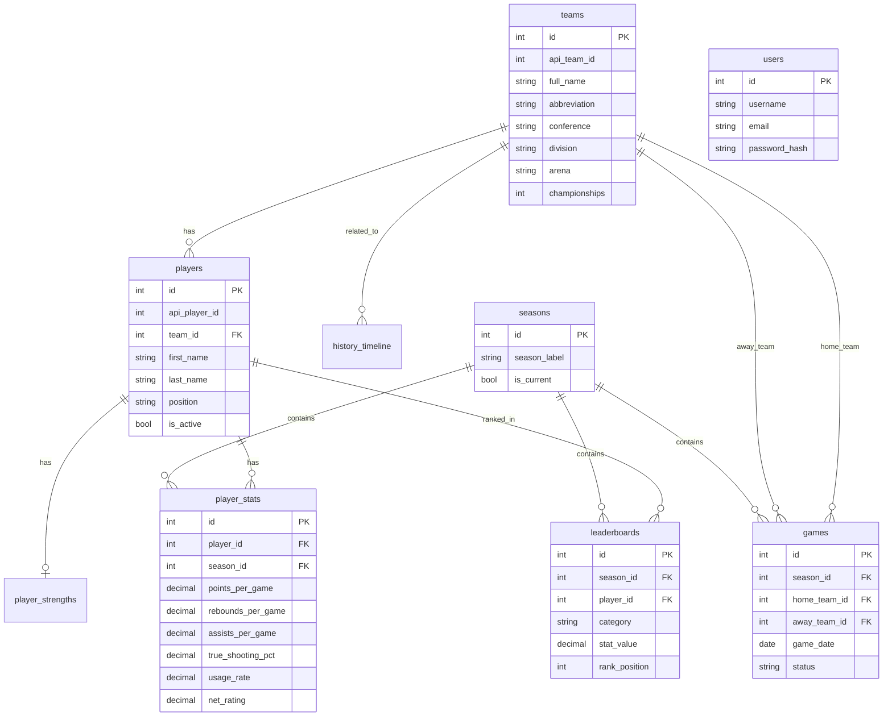

# CourtStars System Explanation

CourtStars is an NBA analytics web application that combines a PHP back end, a MySQL database, a JavaScript frontend, public ESPN APIs, and Python-based NBA statistics fetching. It is designed as a functional AppDev + DBMS prototype: the frontend presents players, teams, news, leaderboards, charts, history, authentication, favorites, and comparison tools, while the backend processes requests, connects to MySQL, syncs live data, and returns JSON responses.

## 1. System Overview

The system follows a simple client-server architecture:

1. The user opens `frontend/index.html` in the browser.
2. `frontend/function.js` calls PHP API endpoints using `fetch()`.
3. PHP endpoints connect to MySQL through `config/db.php`.
4. MySQL stores teams, players, seasons, stats, leaderboards, games, history, and users.
5. Some endpoints call external NBA/ESPN data sources to keep the app updated.
6. The frontend renders the returned JSON into cards, tables, charts, modals, search results, and profile views.

High-level data flow:



## 2. Interface Design

CourtStars uses a sports-dashboard style interface. The design is organized around fast scanning, NBA branding, and interactive data views.

Main interface areas:

- **Loader:** Shows a branded loading screen while the app initializes.
- **Schedule bar:** Displays NBA games, scores, and upcoming schedule information.
- **Sticky navbar:** Gives quick access to Home, News, Players, Teams, Stats & Rankings, History, Court Moments, Learn, Search, and Login/Profile.
- **Hero section:** Introduces the app with summary statistics and call-to-action buttons.
- **News section:** Shows live NBA articles from ESPN.
- **Player section:** Displays searchable/filterable player data in table and card views.
- **Team section:** Displays NBA team information, colors, arenas, history, rivals, and roster counts.
- **Leaderboards:** Shows top players by points, rebounds, assists, steals, blocks, three-point percentage, PER, true shooting, usage, and net rating.
- **Charts:** Visualizes scoring, shooting, and advanced statistics.
- **History / Court Moments:** Presents NBA timeline and historical highlights.
- **Login/Profile:** Allows users to register, sign in, update profile information, delete account, save favorites, and manage session state.

Basic UI mockup:

```text
+--------------------------------------------------------------+
| Schedule Bar: BOS 102 - LAL 99 | Upcoming: NYK @ MIA          |
+--------------------------------------------------------------+
| CourtStars Logo | Home News Players Teams Stats History Login |
+--------------------------------------------------------------+
| Hero: Legends Are Made Here                                   |
| Active Players | Teams | Championships                        |
+--------------------------------------------------------------+
| News Cards                                                   |
+--------------------------------------------------------------+
| Players: Search | Team Filter | Position | Sort | View Toggle |
| Player Table / Player Cards                                  |
+--------------------------------------------------------------+
| Teams Directory | Leaderboards | Charts | History             |
+--------------------------------------------------------------+
```

Why this design is needed:

- It gives users direct access to major NBA data categories.
- It supports both casual browsing and stat-focused comparison.
- It keeps repeated actions, such as searching and filtering players, available without needing page reloads.
- It makes the prototype feel like a complete web application rather than a static page.

## 3. System Flow

### 3.1 Page Load Flow



### 3.2 Player Data Flow



### 3.3 Authentication Flow



### 3.4 Kubernetes Deployment Flow



### 3.5 Input and Output Data Flow

CourtStars has three main types of input: user interface input, external API input, and administrator/deployment input. These inputs are processed by JavaScript, PHP, MySQL, Python, Docker, and Kubernetes, then returned as visual or JSON output.



#### User Input Flow

| User Input | Frontend File/Function | Backend Endpoint | Database Table | Output |
|---|---|---|---|---|
| Open homepage | `index.html`, `init()` in `function.js` | Multiple GET endpoints | Multiple tables | Homepage sections render with current data |
| Search player/team | `runGlobalSearch()`, player filters | Usually no new backend request after initial load | Already loaded `players` and `teams` data | Filtered search results |
| Filter players by team/position | `renderPlayers()`, `getFilteredPlayers()` | Data comes from `get_players.php` initial response | `players`, `teams`, `player_stats` | Updated player table/cards |
| Sort players | `sortTable()` / sort select handlers | Data comes from loaded player array | `players`, `player_stats` | Reordered table/cards |
| Select leaderboard tab | `setLbTab()`, `renderLeaderboard()` | `get_leaderboards.php?category=...` | `leaderboards`, `players`, `teams` | Ranked player list |
| Open player modal | `openPlayerModal(id)` | Uses loaded player data | `players`, `player_stats`, `teams` | Detailed player modal |
| Open team modal | `openTeamModal(abbrev)` | Uses loaded team data | `teams`, `players` | Detailed team modal |
| Register account | `login.html` register handler | `api/auth/register.php` | `users` | New account, token, user saved in browser |
| Log in | `login.html` login handler | `api/auth/login.php` | `users` | Authenticated user session |
| Update profile | `handleProfileUpdate()` / login page update | `api/auth/update.php` | `users` | Updated user profile |
| Delete account | `promptDeleteAccount()` / delete handler | `api/auth/delete.php` | `users` | User row removed |
| Favorite player | `toggleFavorite()` | No backend endpoint currently | Browser `localStorage` | Favorite icon/list updates |

#### Backend Input and Output Flow

| Endpoint | Input Data | Processing | Output Data |
|---|---|---|---|
| `api/get_summary.php` | HTTP GET | Counts rows and championship totals | JSON summary counts |
| `api/get_players.php` | Optional `team_id`, `position`, `search` query parameters | Checks stale data, may run sync, joins players/teams/stats | JSON player list with stats and strengths |
| `api/get_teams.php` | HTTP GET | Tries ESPN team API, enriches with metadata, falls back to DB | JSON team list |
| `api/get_leaderboards.php` | `category`, `limit` query parameters | Validates category, rebuilds leaderboard if empty, queries rankings | JSON ranked players |
| `api/get_charts.php` | HTTP GET | Queries top statistical categories | JSON chart datasets |
| `api/get_ticker.php` | HTTP GET | Gets ESPN scoreboard and DB scoring leader | JSON games and scoring leader |
| `api/get_news.php` | Optional `limit` query parameter | Fetches ESPN news and selects images | JSON news articles |
| `api/get_history.php` | HTTP GET | Reads history timeline rows | JSON history events |
| `api/sync_stats.php` | Browser/CLI/API trigger | Syncs teams, rosters, stats, leaderboards, and games | JSON sync log |
| `api/auth/register.php` | Username, email, password, display name | Validates input, hashes password, inserts user | JSON user and token |
| `api/auth/login.php` | Email/username and password | Verifies password and updates last login | JSON user and token |
| `api/auth/update.php` | Token, current password, updated fields | Verifies user and updates fields | JSON updated user |
| `api/auth/delete.php` | Token and password | Verifies password and deletes account | JSON success message |

#### External Data Input Flow



External input is needed because CourtStars depends on current NBA data. ESPN provides public teams, rosters, scoreboard, and news. The Python `nba_api` library provides deeper player statistics and advanced metrics.

#### Output Types

| Output Type | Where It Appears | Source |
|---|---|---|
| HTML page | Browser | `frontend/index.html`, `learn.html`, `login.html` |
| Styled interface | Browser | `frontend/styles.css` |
| Dynamic cards/tables/modals | Browser | `frontend/function.js` rendering API JSON |
| JSON API response | Browser/dev tools/API tests | PHP API endpoints |
| Database records | MySQL | PHP sync, auth, and query endpoints |
| Container image | Docker | `Dockerfile` |
| Running pods/services | Kubernetes | `k8s/*.yaml` manifests |

#### Example End-to-End Input/Output Scenario

Example: user searches and views a player.

```text
Input:
User types "LeBron" in the player search box.

Process:
function.js filters the already loaded players array.
The player array originally came from get_players.php.
get_players.php queried players, teams, player_stats, and player_strengths.

Output:
The Players section updates to show matching player records.
When the user opens a player, a modal shows profile, stats, strengths, recent games, and team information.
```

Example: user registers an account.

```text
Input:
Username, email, password, and display name.

Process:
login.html sends a POST request to api/auth/register.php.
register.php validates the input, checks duplicates, hashes the password, and inserts a row into users.

Output:
The backend returns JSON containing success=true, user data, and a token.
The browser saves the user and token in localStorage.
The navbar changes from Sign In to the user profile menu.
```

## 4. Entity Relationship Diagram

The database is centered on NBA teams, players, seasons, player statistics, leaderboards, games, history, and users.



## 5. File-by-File Explanation

### 5.1 Frontend Files

#### `frontend/index.html`

Purpose: Main web application page.

What it contains:

- Loader screen.
- Global search modal.
- Schedule bar.
- Sticky navigation.
- Mobile menu.
- Hero section.
- Sections for news, players, teams, leaderboards, charts, history, and Court Moments.
- Modal containers for players, teams, comparisons, profiles, and news.
- Script reference to `function.js`.

Why it is needed:

- It is the main user interface shell.
- It defines the DOM elements that JavaScript fills with live data.
- Without this file, the user has no main page to interact with.

#### `frontend/function.js`

Purpose: Main frontend controller.

What it does:

- Defines API endpoint paths.
- Stores global application state such as players, teams, leaderboards, summary stats, news, favorites, and compare selections.
- Fetches data from PHP APIs.
- Maps raw API responses into frontend-friendly objects.
- Renders players, teams, charts, leaderboards, news, ticker, modals, search results, favorites, and profile UI.
- Handles UI events such as filtering, sorting, pagination, comparing players, opening modals, and global search.
- Uses `localStorage` for favorites and basic user session information.

Why it is needed:

- It turns static HTML into a dynamic single-page style application.
- It connects the browser to the PHP backend.
- It handles the client-side behavior expected from a functional prototype.

Important API configuration:

```js
const API = {
  players:      '/courtstars/api/get_players.php',
  teams:        '/courtstars/api/get_teams.php',
  leaderboards: '/courtstars/api/get_leaderboards.php',
  charts:       '/courtstars/api/get_charts.php',
  ticker:       '/courtstars/api/get_ticker.php',
  summary:      '/courtstars/api/get_summary.php',
  history:      '/courtstars/api/get_history.php',
  news:         '/courtstars/api/get_news.php',
  sync:         '/courtstars/api/sync_stats.php',
};
```

#### `frontend/styles.css`

Purpose: Main visual design file.

What it controls:

- Layout.
- Colors.
- Typography.
- Responsive design.
- Cards, tables, modals, navbar, loader, hero section, search overlay, player/team sections, charts, and buttons.

Why it is needed:

- It makes the web app usable and visually consistent.
- It supports the interface design requirement by defining the complete look and feel.

#### `frontend/login.html`

Purpose: Authentication and profile management page.

What it does:

- Shows login and registration forms.
- Sends login requests to `api/auth/login.php`.
- Sends registration requests to `api/auth/register.php`.
- Allows profile update through `api/auth/update.php`.
- Allows account deletion through `api/auth/delete.php`.
- Stores successful login information in `localStorage`.

Why it is needed:

- It provides the user account feature.
- It proves database integration beyond read-only NBA data.
- It allows favorites/profile behavior to be associated with a signed-in user on the client side.

#### `frontend/learn.html`

Purpose: Educational NBA/stat glossary page.

What it does:

- Displays basketball terms and stat explanations.
- Provides glossary filtering and expandable items.

Why it is needed:

- It helps users understand analytics terms used in the app.
- It supports usability for users who are not deeply familiar with NBA statistics.

#### `frontend/imgs/*`

Purpose: Static visual assets.

What it includes:

- Logo.
- Basketball court background.
- Player or theme images.

Why it is needed:

- The app uses these assets for branding, hero visuals, loader visuals, and spotlight sections.

### 5.2 Configuration and Database Files

#### `config/constants.php`

Purpose: Central environment configuration.

What it defines:

- `DB_HOST`
- `DB_NAME`
- `DB_USER`
- `DB_PASS`
- `NBA_API_KEY`
- `STATS_STALE_HOURS`

Why it is needed:

- It lets the same app run in XAMPP, Docker Compose, and Kubernetes.
- In local XAMPP, it falls back to defaults.
- In Docker/Kubernetes, environment variables override the defaults.

#### `config/db.php`

Purpose: Database connection and schema bootstrap.

What it does:

- Creates a PDO connection to MySQL.
- Creates the `courtstars_db` database if it does not exist.
- Creates required tables if they do not exist.
- Adds missing columns for compatibility with newer versions.
- Inserts a default current season row.
- Provides `statsAreStale()` to decide whether live stats should be refreshed.

Why it is needed:

- Every database-backed API depends on this file.
- It removes the need for manual table creation during first run.
- It keeps the database schema aligned with the application code.

Main tables created:

- `teams`
- `players`
- `seasons`
- `player_stats`
- `player_strengths`
- `leaderboards`
- `history_timeline`
- `games`
- `users`

#### `database/migrate_v2.sql`

Purpose: Manual database migration script.

What it does:

- Adds advanced stat columns to `player_stats`.
- Clears old `leaderboards` and `player_stats`.
- Ensures the current season exists.
- Updates the `games.api_game_id` column.

Why it is needed:

- It supports upgrading an existing database from an older schema.
- It is useful if the database already existed before the latest live-stat features were added.

### 5.3 PHP API Files

#### `api/test.php`

Purpose: Health-check endpoint.

What it returns:

```text
PHP WORKS
```

Why it is needed:

- Docker uses it in the image `HEALTHCHECK`.
- Kubernetes uses it for readiness and liveness probes.
- It quickly confirms that Apache and PHP are working.

#### `api/get_summary.php`

Purpose: Returns dashboard summary counts.

What it queries:

- Active players.
- Seasons.
- Teams.
- Total championships.

Why it is needed:

- The homepage hero section uses these values.
- It gives users a fast overview of the database contents.

#### `api/get_players.php`

Purpose: Returns player data with team information, stats, strengths, badges, and recent games.

What it does:

- Connects to MySQL.
- Checks whether the database is empty or stale.
- If stale, calls `syncAll()` from `sync_stats.php`.
- Queries active players.
- Joins player records with teams, player stats, and strengths.
- Supports filtering by team, position, and search text.
- Computes display values such as height and percentages.
- Computes player strength ratings if no manual strength data exists.
- Adds recent team games for player modal displays.

Why it is needed:

- It is the main endpoint for the Players section.
- It is also a major point of AppDev + DBMS integration because it reads from multiple related tables and returns structured JSON to the frontend.

#### `api/get_teams.php`

Purpose: Returns NBA team data.

What it does:

- Tries ESPN's public team API first.
- Enriches teams with local metadata such as arena, legends, rivals, history, and championships.
- Reads roster counts from MySQL.
- Falls back to the local database if ESPN is unavailable.

Why it is needed:

- It powers the Teams section.
- It gives the app resilience because it can still work if the external ESPN API fails.

#### `api/get_leaderboards.php`

Purpose: Returns ranked player lists by category.

What it supports:

- Points.
- Rebounds.
- Assists.
- Steals.
- Blocks.
- Three-point percentage.
- PER / player impact estimate.
- True shooting percentage.
- Usage.
- Net rating.

What it does:

- Validates the requested category.
- Limits result count.
- Rebuilds leaderboards if the table is empty.
- Joins leaderboards with players and teams.
- Returns ranked JSON data.

Why it is needed:

- It powers the Stats & Rankings section.
- It avoids recalculating rankings on every frontend render by storing leaderboard rows in the database.

#### `api/get_charts.php`

Purpose: Returns chart-ready stat data.

What it queries:

- Scoring leaders.
- Three-point percentage leaders.
- PER leaders.
- True shooting leaders.
- Usage leaders.
- Net rating leaders.

Why it is needed:

- It powers visual analytics charts.
- It separates chart-specific SQL from general player-list SQL.

#### `api/get_ticker.php`

Purpose: Returns schedule ticker data and top scoring leader.

What it does:

- Fetches live NBA scoreboard data from ESPN.
- Falls back to cached `games` table records if ESPN is unavailable.
- Queries the current scoring leader from MySQL.

Why it is needed:

- It powers the schedule bar and live game ticker.
- It combines external live data with local DB analytics.

#### `api/get_news.php`

Purpose: Fetches NBA news from ESPN.

What it does:

- Calls ESPN's public NBA news endpoint.
- Extracts headline, description, story, source, date, category, image, and URL.
- Chooses the best article image.
- Uses fallback basketball images when ESPN does not provide a useful image.

Why it is needed:

- It powers the News section.
- It keeps the app content current without needing manual news entry.

#### `api/get_history.php`

Purpose: Returns historical timeline records from MySQL.

What it queries:

- Year.
- Title.
- Description.
- Category.
- Image.
- Related player.

Why it is needed:

- It powers the History section.
- It demonstrates a simple database-backed content feature.

#### `api/sync_stats.php`

Purpose: Full data synchronization pipeline.

What it does:

1. Fetches NBA teams from ESPN.
2. Fetches team rosters from ESPN.
3. Saves teams and players into MySQL.
4. Runs `scripts/fetch_nba_api.py` to get real per-game and advanced stats.
5. Saves player stats into `player_stats`.
6. Rebuilds `leaderboards`.
7. Syncs recent and upcoming games from ESPN scoreboard.

Why it is needed:

- It is the bridge between external NBA data sources and the local database.
- It makes CourtStars a dynamic prototype instead of a static manually encoded website.
- `get_players.php` can call it automatically when data is missing or stale.

### 5.4 Authentication API Files

#### `api/auth/register.php`

Purpose: Creates a new user account.

What it does:

- Accepts username, email, password, and display name.
- Validates required fields.
- Checks duplicate email/username.
- Hashes the password with bcrypt.
- Inserts the user into MySQL.
- Returns a simple token and user object.

Why it is needed:

- It demonstrates create functionality in the DBMS.
- It supports personalized app behavior.

#### `api/auth/login.php`

Purpose: Authenticates an existing user.

What it does:

- Accepts email/username and password.
- Looks up the user in MySQL.
- Verifies the password hash.
- Updates `last_login`.
- Returns a user object and token.

Why it is needed:

- It lets users access profile-related features.
- It demonstrates secure password verification.

#### `api/auth/update.php`

Purpose: Updates user profile data.

What it does:

- Reads the token from the Authorization header or request body.
- Verifies the user's current password.
- Updates username, display name, email, or password.
- Checks uniqueness of username/email.
- Returns updated user data and a new token.

Why it is needed:

- It demonstrates update functionality in the DBMS.
- It allows users to maintain account information.

#### `api/auth/delete.php`

Purpose: Permanently deletes a user account.

What it does:

- Reads and decodes the user token.
- Verifies the user's password.
- Deletes the user row from MySQL.

Why it is needed:

- It demonstrates delete functionality in the DBMS.
- It gives users control over their account.

### 5.5 Python Files

#### `scripts/fetch_nba_api.py`

Purpose: Fetches NBA player statistics through the Python `nba_api` library.

What it does:

- Calls NBA stat endpoints.
- Reads player traditional and advanced statistics.
- Normalizes player names, team abbreviations, height, weight, country, draft data, and stat fields.
- Outputs JSON to stdout.

Why it is needed:

- PHP handles the web backend, but Python has stronger library support for NBA stat endpoints through `nba_api`.
- This file lets the PHP sync process import richer basketball analytics.

#### `check_params.py`

Purpose: Development helper for inspecting the accepted parameters of `LeagueDashPlayerStats`.

Why it is needed:

- It helps debug or update the Python sync script when `nba_api` changes method parameters.
- It is not required during normal app use.

### 5.6 Deployment and Infrastructure Files

#### `Dockerfile`

Purpose: Builds the CourtStars application container.

What it does:

- Uses `php:8.2-apache`.
- Installs MySQL client tools, Python, pip, requests, numpy, curl, and certificates.
- Installs PHP extensions `pdo_mysql` and `mysqli`.
- Installs Python `nba_api`.
- Enables Apache modules.
- Copies the app into `/var/www/html/courtstars`.
- Defines a health check.

Why it is needed:

- It packages the app so it runs consistently across machines and Kubernetes.

#### `docker-compose.yml`

Purpose: Local multi-container development setup.

What it runs:

- `app`: CourtStars PHP/Apache container.
- `db`: MySQL 8.4 container.

Why it is needed:

- It lets the project run locally with one command.
- It gives the app a database without requiring manual XAMPP MySQL setup.

#### `docker/apache-courtstars.conf`

Purpose: Apache configuration for the CourtStars directory.

Why it is needed:

- It allows Apache to serve `/var/www/html/courtstars`.
- It enables `.htaccess` support if needed.
- It sets `ServerName localhost`.

#### `k8s/00-namespace.yaml`

Purpose: Creates the `courtstars` Kubernetes namespace.

Why it is needed:

- It groups all CourtStars Kubernetes resources together.

#### `k8s/01-configmap.yaml`

Purpose: Stores non-sensitive app configuration.

Contains:

- `DB_HOST`
- `DB_NAME`
- `STATS_STALE_HOURS`

Why it is needed:

- It separates configuration from container images.

#### `k8s/02-secret.yaml`

Purpose: Stores database credentials.

Contains:

- `DB_USER`
- `DB_PASS`
- `MYSQL_ROOT_PASSWORD`

Why it is needed:

- Credentials should not be hardcoded into the app deployment.

#### `k8s/03-mysql-pvc.yaml`

Purpose: Requests persistent storage for MySQL.

Why it is needed:

- It keeps database files available even if the MySQL pod restarts.

#### `k8s/04-mysql-deployment.yaml`

Purpose: Runs the MySQL database in Kubernetes.

What it includes:

- MySQL 8.4 container.
- Environment variables from ConfigMap and Secret.
- PVC mounted at `/var/lib/mysql`.
- Readiness and liveness probes.
- CPU and memory limits.

Why it is needed:

- The application needs a database service inside the Kubernetes cluster.

#### `k8s/05-mysql-service.yaml`

Purpose: Provides an internal stable DNS name for MySQL.

Why it is needed:

- The app connects to MySQL using `courtstars-mysql`.

#### `k8s/06-app-deployment.yaml`

Purpose: Runs the CourtStars app in Kubernetes.

What it includes:

- Two app replicas.
- Rolling update strategy.
- Image tag, currently `courtstars:1.2.0`.
- Environment variables from ConfigMap and Secret.
- Readiness and liveness probes.
- CPU and memory limits.

Why it is needed:

- It manages app pods, updates, rollbacks, and self-healing.

#### `k8s/07-app-service.yaml`

Purpose: Exposes the CourtStars app service.

What it does:

- Selects pods with `app: courtstars-app`.
- Forwards service port `80` to container port `80`.
- Defines NodePort `30080`.

Why it is needed:

- It gives users and `kubectl port-forward` a stable way to reach the app.

#### `k8s/08-hpa.yaml`

Purpose: Defines autoscaling rules.

What it does:

- Targets the app Deployment.
- Keeps at least 2 replicas.
- Allows up to 5 replicas.
- Uses 60 percent average CPU utilization as the target.

Why it is needed:

- It demonstrates application scaling in Kubernetes.

#### `diagnose.php`

Purpose: Diagnostic/development PHP file.

Current note:

- Its contents appear to duplicate the sync script documentation and implementation pattern.
- It is useful for debugging, but the main runtime sync endpoint is `api/sync_stats.php`.

Why it is needed:

- It can help inspect or test backend behavior during development, but it is not part of the main user flow.

## 6. Backend Functionality

The backend is implemented with PHP API endpoints. Each endpoint returns JSON so the frontend can consume it asynchronously.

Main backend responsibilities:

- Connect to MySQL using PDO.
- Validate request parameters.
- Query relational data.
- Join related tables.
- Format response fields.
- Call external APIs.
- Run data synchronization.
- Register, authenticate, update, and delete users.
- Return clear success/error responses.

Example pattern:

```php
header('Content-Type: application/json');
require_once __DIR__ . '/../config/db.php';
$pdo = getDBConnection();
```

This pattern appears across API files. It ensures the endpoint returns JSON and has a database connection.

## 7. Database Integration

CourtStars integrates with MySQL through `config/db.php` and PDO.

How integration works:

1. PHP reads database settings from environment variables or local defaults.
2. `getDBConnection()` opens a PDO connection.
3. The database is created automatically if missing.
4. Tables are created automatically if missing.
5. API endpoints query or update tables.
6. Results are encoded as JSON.
7. JavaScript fetches the JSON and renders it.

Important integration examples:

- `get_players.php` joins `players`, `teams`, `player_stats`, and `player_strengths`.
- `get_leaderboards.php` joins `leaderboards`, `players`, and `teams`.
- `sync_stats.php` inserts/updates teams, players, stats, leaderboards, and games.
- `register.php`, `login.php`, `update.php`, and `delete.php` manage rows in `users`.

## 8. Tools and Technologies Used

Frontend:

- HTML5 for page structure.
- CSS3 for visual design and responsiveness.
- JavaScript for dynamic rendering and API calls.
- Browser `localStorage` for user session and favorites.

Backend:

- PHP 8.2 for API endpoints.
- PDO for MySQL access.
- cURL for external ESPN API calls.
- bcrypt password hashing through `password_hash()` and `password_verify()`.

Database:

- MySQL 8.4.
- InnoDB tables.
- Foreign keys for relational integrity.

External data:

- ESPN public APIs for teams, rosters, scoreboard, and news.
- Python `nba_api` for advanced NBA statistics.

Deployment:

- Docker for container image creation.
- Docker Compose for local multi-container development.
- Kubernetes for deployment, service discovery, scaling, self-healing, updates, and rollback.
- Apache HTTP Server for serving PHP and frontend files.

## 9. Functional Prototype System

CourtStars qualifies as a functional AppDev + DBMS prototype because it includes:

- A working multi-page user interface.
- Dynamic frontend rendering.
- PHP backend APIs.
- MySQL database integration.
- User registration and login.
- CRUD-like account operations.
- Live or synced NBA data.
- Relational schema with foreign keys.
- Docker and Kubernetes deployment.
- Health checks and scaling configuration.

Prototype features:

- View NBA players and statistics.
- Search/filter/sort player records.
- View NBA teams.
- View leaderboards.
- View charts.
- View NBA news.
- View game ticker/schedule data.
- Register/login/update/delete user account.
- Save favorites in browser storage.
- Compare players.
- Deploy locally or in Kubernetes.

## 10. Testing Prototype With Sample Users

### Sample User Test Plan

Test users:

- **User A: Casual NBA fan**
  - Goal: Read news and browse popular players.
  - Tasks: Open homepage, read news, search for a player, open player modal.

- **User B: Stats-focused student**
  - Goal: Compare player performance.
  - Tasks: Open Players, sort by points, filter by position, compare two players, view leaderboards.

- **User C: Registered user**
  - Goal: Use account features.
  - Tasks: Register, log in, update profile, favorite players, delete account.

- **User D: Developer/tester**
  - Goal: Verify backend and deployment.
  - Tasks: Call API endpoints, run sync, check database records, deploy with Docker/Kubernetes.

### Suggested Test Cases

| Test Case | Steps | Expected Result |
|---|---|---|
| Homepage loads | Open `/courtstars/frontend/index.html` | Loader disappears and homepage sections render |
| Summary API | Call `/api/get_summary.php` | JSON contains players, seasons, teams, championships |
| Player list | Open Players section | Players appear in table/card view |
| Player search | Search a player name | List filters to matching players |
| Team filter | Select a team | Only players from selected team appear |
| Leaderboard | Click ranking tabs | Ranking list changes by selected category |
| News | Open News section | ESPN news cards appear |
| Register | Submit valid registration | New user is saved in `users` table |
| Login | Submit valid credentials | User is logged in and token is stored |
| Update profile | Change display name/email | Database row updates |
| Delete account | Confirm password and delete | User row is removed |
| Sync data | Call `/api/sync_stats.php` | Teams, players, stats, games, leaderboards update |
| Kubernetes self-healing | Delete app pod | Replacement pod is created |
| Kubernetes scaling | Scale replicas to 4 | Four app pods run |

### Evaluation Results Template

| User | Completed Tasks | Issues Found | Rating |
|---|---:|---|---:|
| User A | 4/4 | Wanted faster news loading | 4/5 |
| User B | 4/4 | Asked for clearer stat definitions | 4/5 |
| User C | 4/5 | Wanted password visibility toggle and stronger session handling | 3.5/5 |
| User D | 5/5 | HPA CPU metrics may show unknown if metrics-server is unavailable | 4/5 |

### Improvement Recommendations

- Add server-side sessions or JWT signing instead of plain base64 tokens.
- Store favorites in the database instead of only `localStorage`.
- Add loading and error states for every data section.
- Add admin tools for manually managing history records and featured content.
- Add automated PHPUnit or API integration tests.
- Add frontend tests for filtering, sorting, login, and modal behavior.
- Add metrics-server setup instructions for Kubernetes HPA.
- Add cache layers for ESPN API calls to reduce slow external requests.
- Improve accessibility with more ARIA labels and keyboard support.
- Add user feedback forms for evaluating the prototype.

## 11. System Explanation Summary

CourtStars works by using the frontend as the presentation layer, PHP as the application/backend layer, MySQL as the database layer, ESPN/nba_api as external data providers, and Docker/Kubernetes as the deployment layer. The frontend does not directly access the database. Instead, it calls PHP endpoints. The PHP endpoints process requests, query or update MySQL, optionally fetch external NBA data, and return JSON. JavaScript receives that JSON and updates the interface dynamically.

This separation is important because:

- The frontend stays focused on user interaction and rendering.
- The backend controls database access and data processing.
- MySQL stores persistent application data.
- External APIs supply current NBA information.
- Docker and Kubernetes make deployment repeatable.
